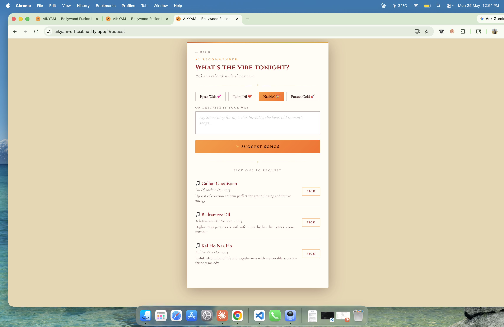
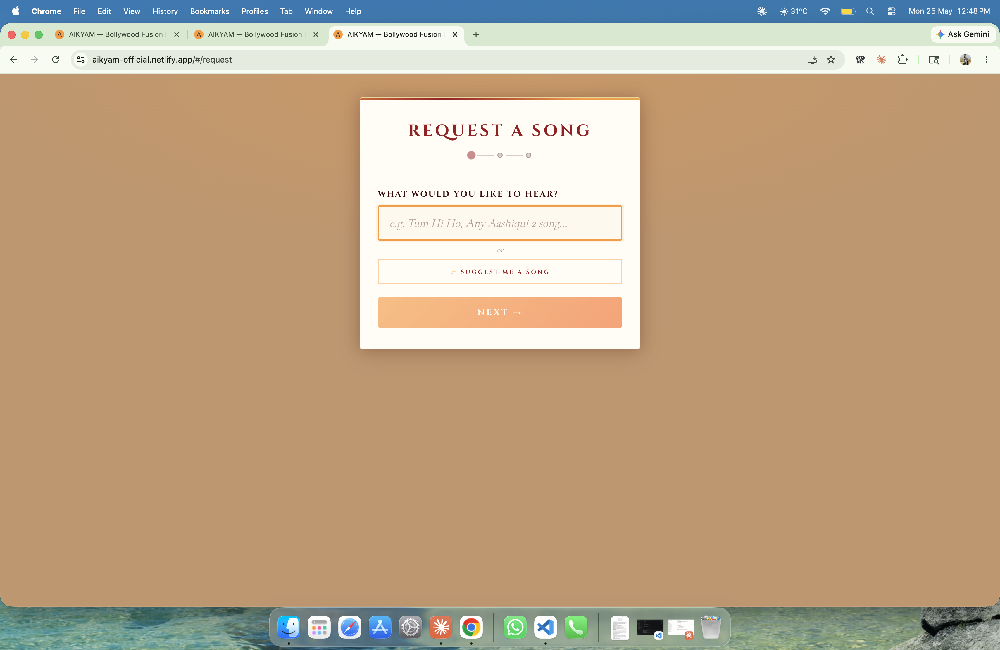
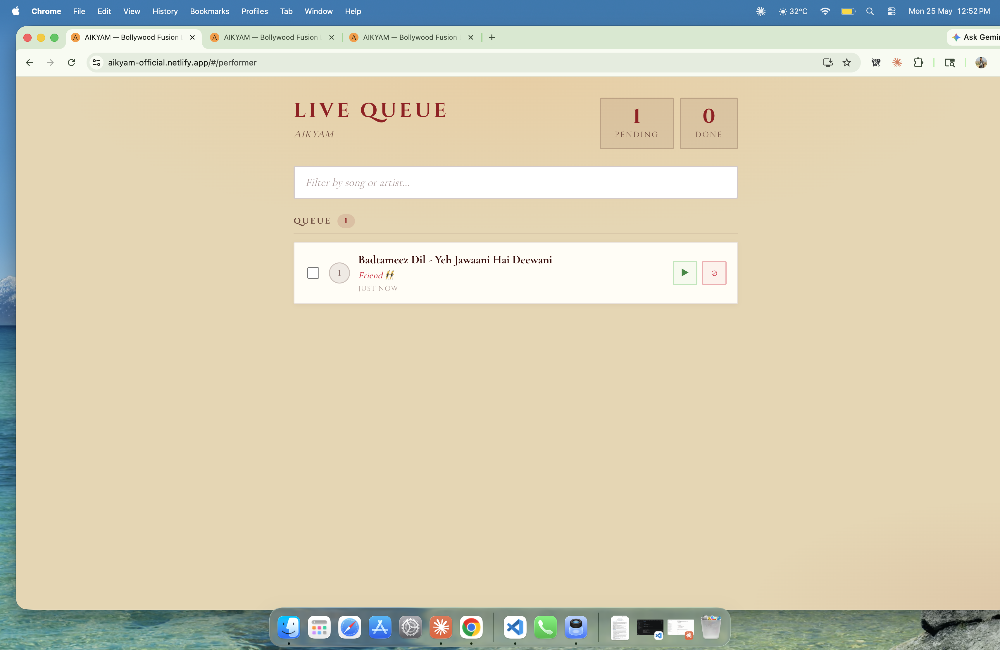
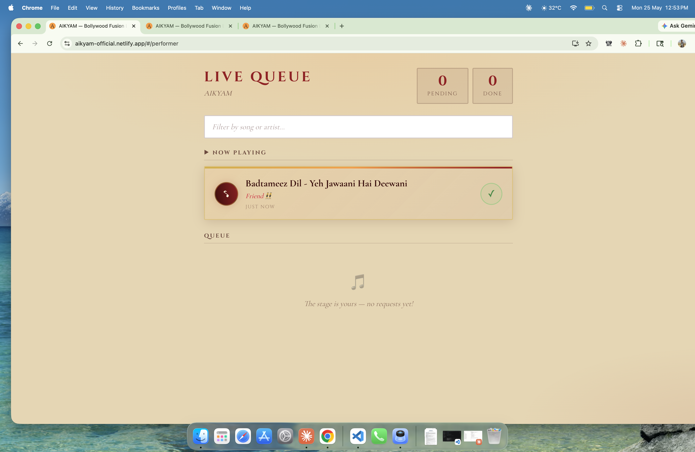

# 🎵 Aikyam — AI-Powered Song Request Platform

> Live song request platform for **Aikyam**, a Bollywood fusion acoustic duo based in Bengaluru.  
> Audiences request songs, AI suggests what fits the vibe, performers manage the queue in real time.

🔗 **Live App:** https://aikyam-official.netlify.app

---

## ✨ Features

- 🤖 **AI Chatbot** — Powered by Claude AI (Haiku) for answering questions about the band, schedule, and events
- 🎶 **AI Song Suggester** — Claude Sonnet suggests songs based on mood and preference
- 📋 **Real-time Queue** — Supabase-backed live song request queue
- 🎤 **Performer Dashboard** — Protected view for managing and updating request status
- 👥 **Role-based Views** — Separate UI for audience and performers
- 📱 **Responsive Design** — Mobile-first, works on any device

---

## 🛠 Tech Stack

| Layer | Technology |
|---|---|
| Frontend | React 19, React Router |
| Styling | SASS/SCSS |
| AI | Claude API (Haiku + Sonnet) via Netlify Functions |
| Database | Supabase (real-time requests) |
| Sheets Integration | Google Apps Script |
| Deployment | Netlify (with serverless functions) |

---

## 🔐 Security

- Claude API key is **never exposed to the browser** — all AI calls route through a Netlify serverless function
- Performer dashboard is PIN-protected via environment variable
- All sensitive config managed through environment variables

---

## 🚀 Getting Started

### 1. Clone the repo
```bash
git clone https://github.com/jobin-j/aikyam.git
cd aikyam
```

### 2. Install dependencies
```bash
npm install
```

### 3. Set up environment variables
```bash
cp .env.example .env
```
Fill in your values in `.env`:
```
REACT_APP_PERFORMER_PIN=your_pin
REACT_APP_GOOGLE_SCRIPT_URL=your_google_apps_script_url
REACT_APP_SUPABASE_URL=your_supabase_url
REACT_APP_SUPABASE_ANON_KEY=your_supabase_anon_key
```

### 4. Run locally
```bash
npm start
```

---

## 📱 App Views

| Route | Description |
|---|---|
| `/` | Landing page — band info, booking |
| `/#/request` | Audience song request form + AI suggester |
| `/#/queue` | Live queue view for audience |
| `/#/performer` | PIN-protected performer dashboard |

---

## 📸 Screenshots

### Homepage + AI Virtual Assistant


### AI Song Suggester — Mood-based Recommendations


### Song Request Form


### Request Confirmed — Queue Position


### Performer Dashboard


## 👨‍💻 Built by

**Jobin John** — Senior Front-End Engineer  
[LinkedIn](https://linkedin.com/in/jobinjohn) • [GitHub](https://github.com/jobin-j)